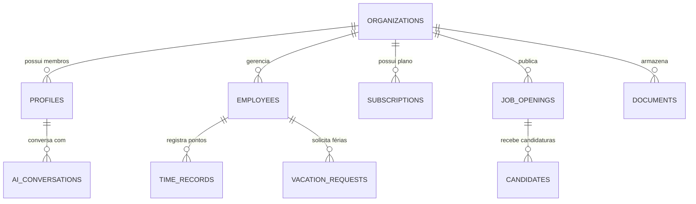

# 🏛️ Arquitetura Multi-Tenant de Dados & Escalabilidade SaaS: NexuHR no Supabase

**Data de Emissão:** 20 de Setembro de 2026  
**Responsável:** Especialista em Pesquisa e Arquitetura de Sistemas (`pesquisador`)  
**Tecnologias:** Next.js 14+ (App Router), Supabase (PostgreSQL, Auth, RLS, Storage), Vercel  

---

## 1. 🎯 Princípios de Escalabilidade para o SaaS NexuHR

Para transformar o NexuHR em um SaaS escalável e pronto para suportar milhares de empresas (desde PMEs de 10 colaboradores até empresas de 1.000+ funcionários), adotamos o modelo **Multi-Tenant Baseado em Linhas com Isolamento Estrito via Row-Level Security (RLS)** no PostgreSQL do Supabase.

### 1.1. Vantagens da Abordagem
- **Custo e Operação Otimizados:** Um único cluster de banco de dados PostgreSQL com isolamento lógico rígido por `organization_id`.
- **Segurança Nativa no Banco:** Nenhuma consulta consegue vazar dados de outra organização, pois o motor do PostgreSQL avalia o JWT do usuário autenticado (`auth.uid()`).
- **Deploy Serverless na Vercel:** Conexão otimizada via Supabase connection pooler (Supavisor / Transaction Mode) com `@supabase/ssr`.

---

## 2. 🗄️ Modelagem Entidade-Relacionamento (ERD)

### 2.1. Entidades Principais
1. **`organizations`**: Organização/empresa assinante do SaaS (nome, CNPJ, slug, plano, status).
2. **`profiles`**: Usuários autenticados no sistema (ligado a `auth.users`), com `role` (`admin`, `manager`, `employee`).
3. **`employees`**: Registro completo do funcionário (cargo, departamento, salário, data de admissão, saldo de férias, status).
4. **`time_records`**: Registros de ponto eletrônico com carimbo de tempo inviolável, tipo de batida (`entrada`, `intervalo`, `retorno`, `saida`), geolocalização e hash de integridade (Portaria 671 MTE).
5. **`vacation_requests`**: Solicitações de férias e ausências com status de aprovação (`pending`, `approved`, `rejected`).
6. **`job_openings` & `candidates`**: Módulo ATS de recrutamento com estágios do pipeline Kanban (`triagem`, `entrevista`, `proposta`, `contratado`).
7. **`documents`**: Gestão de holerites e contratos com status de assinatura digital (`signed`, `pending`).
8. **`subscriptions`**: Controle de faturamento e limites do plano SaaS (Starter, Growth, Enterprise).
9. **`ai_conversations`**: Histórico de interações com o Nexu AI Copilot para contexto conversacional.

---

## 3. 🔐 Estratégia de Segurança & RLS (Row Level Security)

Cada tabela contém uma coluna `organization_id UUID REFERENCES organizations(id)`.
As políticas de RLS garantem:
- **Leitura/Escrita Restrita:** Um usuário autenticado só pode consultar e modificar registros associados à sua própria organização.
- **Funções de Acesso (`is_org_admin()`, `get_auth_org_id()`):** Helpers de banco de dados para checagem de privilégios de administrador sem complexidade no frontend.

---

## 4. ⚡ Próximos Passos
O relatório é repassado para a implementação dos scripts SQL (`supabase/schema.sql`, `supabase/rls_policies.sql`, `supabase/seed.sql`) e para a construção da aplicação completa no **Next.js**.
