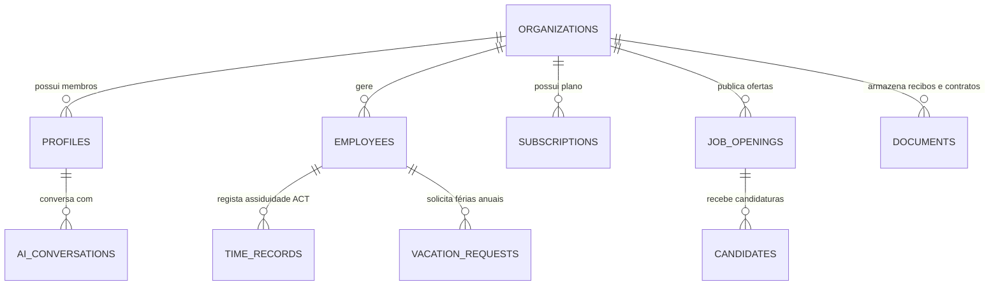

# 🏛️ Arquitetura Multi-Tenant de Dados & Escalabilidade SaaS: NexusLT no Supabase

**Empresa:** NexusLT Lda. (Porto, Portugal)  
**Tecnologias:** Next.js 14+ (App Router), Supabase (PostgreSQL, Auth, RLS, Storage), Vercel  
**Enquadramento Legal:** Código do Trabalho de Portugal (Lei n.º 7/2009), ACT, RGPD.

---

## 1. 🎯 Princípios de Escalabilidade para o SaaS NexusLT

Para suportar PMEs em Portugal (desde microempresas de 10 colaboradores até empresas de 1.000+ funcionários), adotámos o modelo **Multi-Tenant Baseado em Linhas com Isolamento Estrito via Row-Level Security (RLS)** no PostgreSQL do Supabase.

### 1.1. Vantagens da Abordagem
- **Custo e Operação Otimizados:** Um único cluster de base de dados PostgreSQL com isolamento lógico rígido por `organization_id`.
- **Segurança Nativa & RGPD:** Nenhuma consulta consegue vazar dados de outra organização, pois o motor do PostgreSQL avalia o JWT do utilizador autenticado (`auth.uid()`).
- **Deploy Serverless na Vercel:** Conexão otimizada via Supabase connection pooler (Supavisor / Transaction Mode) com `@supabase/ssr`.

---

## 2. 🗄️ Modelagem Entidade-Relacionamento (ERD)

### 2.1. Entidades Principais
1. **`organizations`**: Empresa subscritora do SaaS (denominação social, NIPC, slug, concelho/Porto, plano em Euros, status).
2. **`profiles`**: Utilizadores autenticados (ligado a `auth.users`), com cargo de acesso (`admin`, `manager`, `employee`).
3. **`employees`**: Ficha do colaborador (cargo, departamento, vencimento em Euros, NIF, NISS, data de admissão, saldo de 22 dias úteis de férias).
4. **`time_records`**: Registos diários de assiduidade com carimbo temporal e geovalidação conforme o Art.º 202.º do Código do Trabalho e normas da ACT.
5. **`vacation_requests`**: Pedidos de férias anuais e baixas médicas com histórico de aprovação.
6. **`job_openings` & `candidates`**: Módulo ATS de recrutamento com fases do pipeline Kanban (`triagem`, `entrevista`, `proposta`, `contratado`).
7. **`documents`**: Recibos de vencimento e contratos de trabalho sem termo com assinatura digital certificada (eIDAS).
8. **`subscriptions`**: Controlo de faturação em Euros (€) dos planos Starter, Pro e Empresarial.
9. **`ai_conversations`**: Histórico de interações com o NexusLT AI Copilot.

---

## 3. 🔐 Estratégia de Segurança & RLS (Row Level Security)

Cada tabela contém uma coluna `organization_id UUID REFERENCES organizations(id)`.
As políticas de RLS garantem:
- **Leitura/Escrita Restrita:** Um utilizador autenticado só pode consultar e modificar registos associados à sua própria organização.
- **Funções de Acesso (`is_org_admin()`, `get_auth_org_id()`):** Helpers de base de dados para verificação de privilégios de administrador sem sobrecarga no frontend.
